# realsense-kit

## 环境配置

建议使用Python3.10以上

```bash
pip install -r requirements.txt
```

## 运行方式

注意，所有的文件都需要从根目录运行，所有的demo都在`demos`文件夹下，其中有夹爪版本和吸泵版本分成了两个文件夹

首先从工程文件夹打开终端
> 在Windows系统上，一个便捷的打开方式是在工厂文件夹的空白位置Shift+右键，在点击在此处打开Powershell

### 吸泵-颜色识别

在终端输入以下内容，然后回车确认

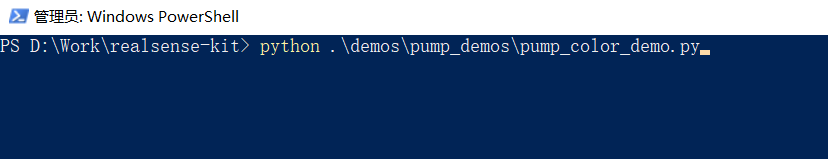

```cmd
python .\demos\pump_demos\pump_color_demo.py
```

### 吸泵-形状识别

在终端输入以下内容，然后回车确认
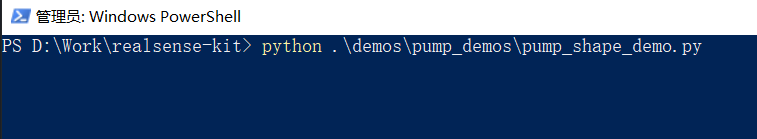

```cmd
python .\demos\pump_demos\pump_shape_demo.py
```

### 吸泵-特征点识别

在终端输入以下内容，然后回车确认
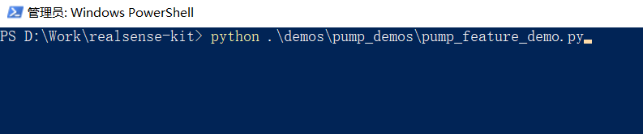

```cmd
python .\demos\pump_demos\pump_feature_demo.py
```

### 吸泵-Yolo识别

在终端输入以下内容，然后回车确认
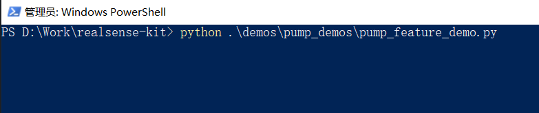

```cmd
python .\demos\pump_demos\pump_feature_demo.py
```

### 吸泵-拆码垛案例

在终端输入以下内容，然后回车确认

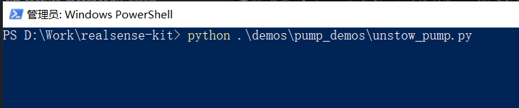

```cmd
python .\demos\pump_demos\unstow_pump.py
```

### 夹爪-颜色识别

在终端输入以下内容，然后回车确认

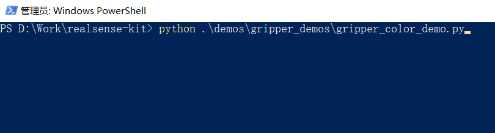

```cmd
python .\demos\gripper_demos\gripper_color_demo.py
```

### 夹爪-特征点识别

在终端输入以下内容，然后回车确认

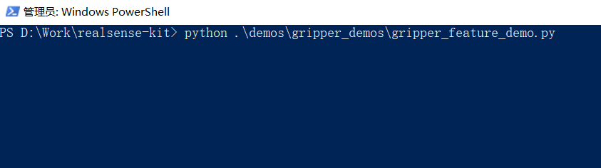

```cmd
python .\demos\gripper_demos\gripper_feature_demo.py
```

### 夹爪-拆码垛案例

在终端输入以下内容，然后回车确认

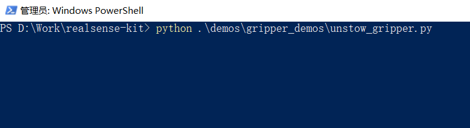

```cmd
python .\demos\gripper_demos\unstow_gripper.py
```

## 物料使用说明

吸泵版本使用的木块较大，夹爪版本使用的较小
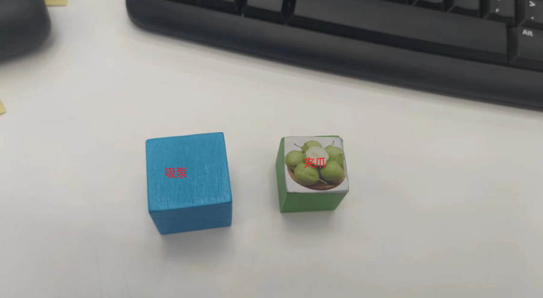
如图所示，蓝色的是吸泵版本的，绿色的夹爪版本的

yolo识别用的是卡片, **夹爪版本没有yolo识别**
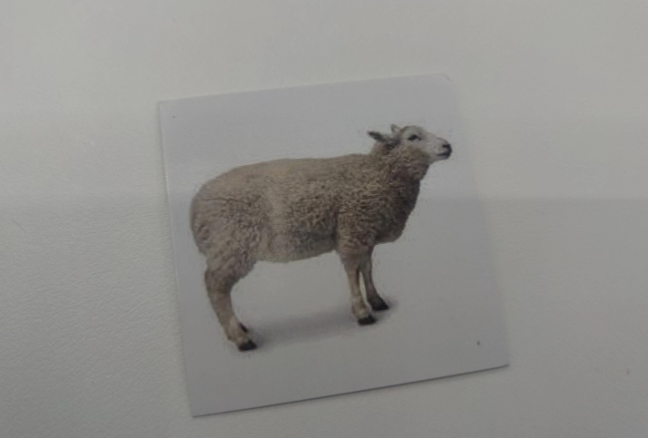

特征点识别一律使用这张图片，这是原图


**吸泵**的特征点识别用的是和拆码垛一样大的木块，上面贴图片，规格是42x30x20mm
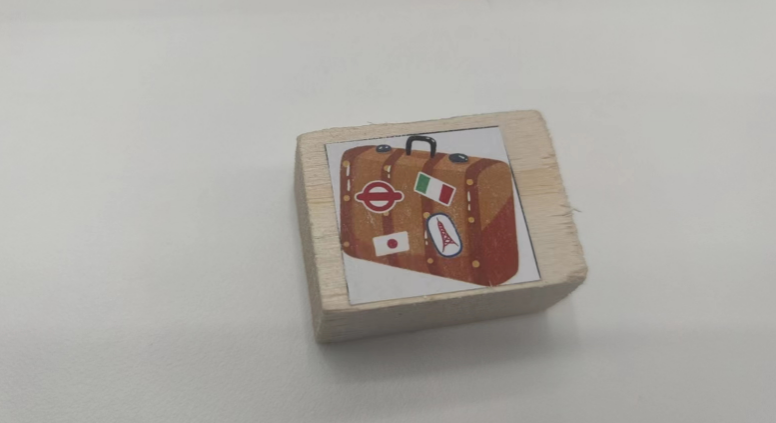

夹爪版本一样，规格是51x20x20mm
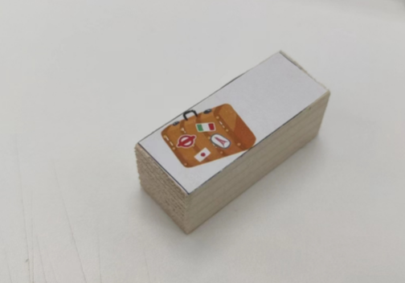

## 硬件安装

realsense相机高度大约在500mm左右
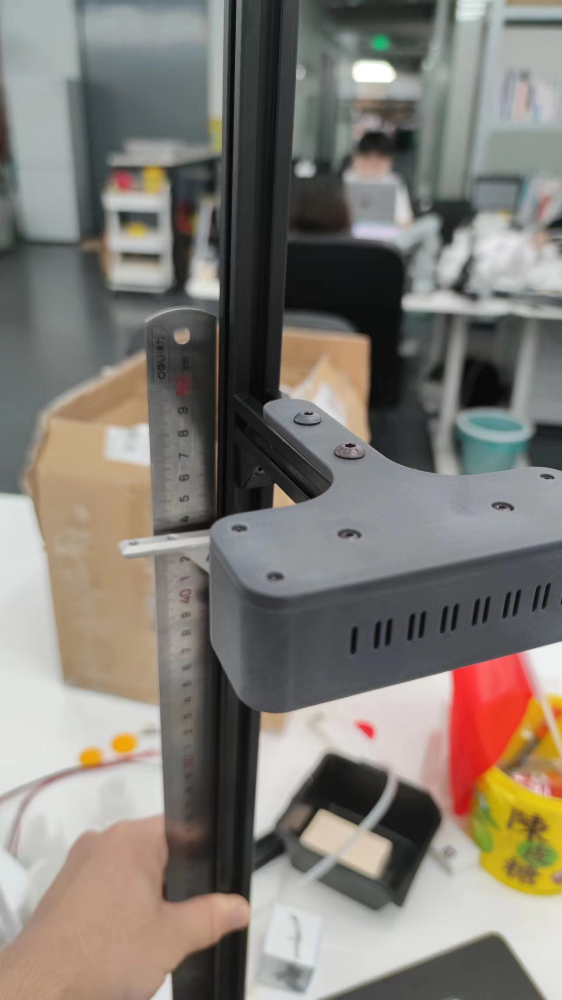

mecharm的安装需要加高底盘，加高底盘长宽高为150x110x33(单位mm)
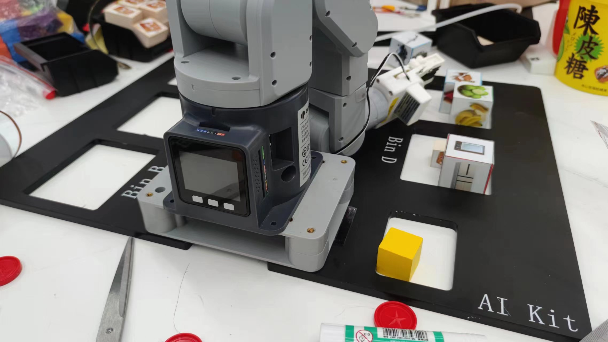

夹爪的安装方式，注意角度
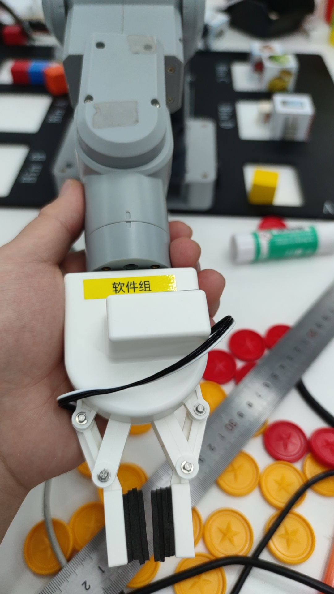

注意夹爪的区别，夹爪是拆掉内侧的塑料，然后用海绵直接粘在上面的，目的是增大夹爪张开后的抓取范围，同时增加缓冲，在测试的时候这一点也要复制

这个夹爪的扭矩参数是特调过的

## 参数调整

参数的调整主要集中在`configs`，其中`config_gripper.py`是夹爪的配置文件, `config_pump.py`是吸泵的配置文件
文件内有各项参数的注释说明

## 杂项

realsense必须要用USB3.2的线连接，而且要独占可以USB3的串口，不要使用拓展坞连接，不然可能会出现不可预料的错误
夹爪版本目前不稳定，尽量用吸泵版本
